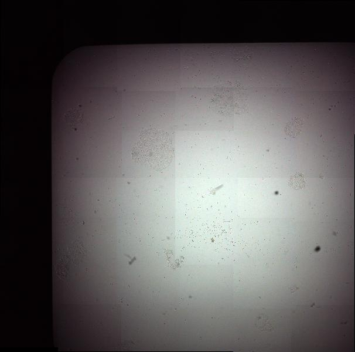

# OIC-137 Colony Forming Analysis

Conda environment can be recreated with [yaml file](/CellPoseCLE.yaml)

This repo is for the image analysis request to build a pipeline for counting cell colonies from bright field images collected with a 10X air objective.

Files are multi-scene pyramidal czi. Because images were collected with bright field and an air objective, there is uneven illumination in each image, with the brightest signal in the middle and dimming out to the edge of the well.

To detect colonies reliably, the illumination needs to be corrected. Testing using gaussian blur based corrections with background subtraction or alpha blurring.

Using Python for this project to increase knowledge base and comfort with using python. Found `pylibCZIrw` package by [Zeiss](https://github.com/ZEISS/pylibczirw/tree/main) for reading in czi files. Individual scenes are read in as numpy compatible arrays.

Gaussian blurring takes a long time to run on large images. Exploring options like [Zarr](https://zarr.readthedocs.io/en/stable/user-guide/groups.html) for chunking data into more manageable pieces.

2025-08-14: This project is in progress but on hold for now. Waiting for new images to be collected.
